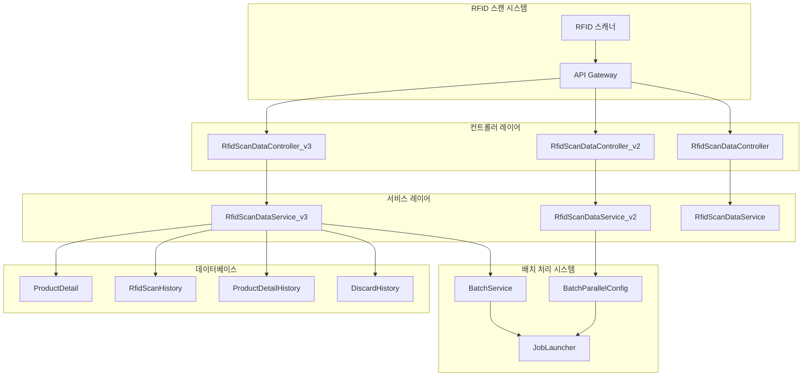
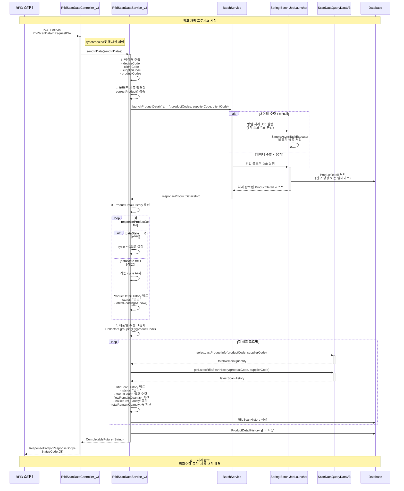
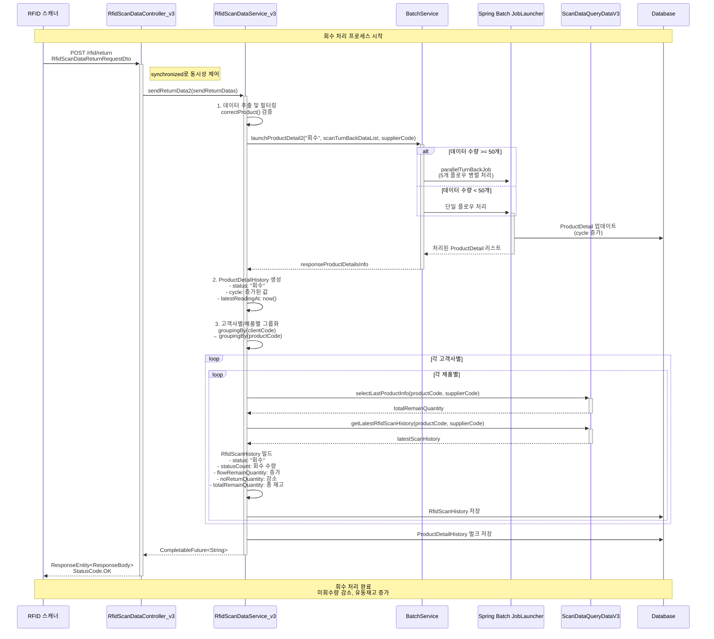
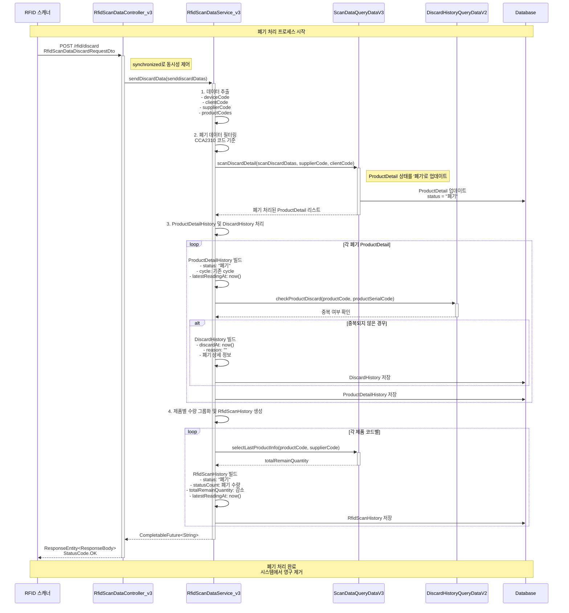
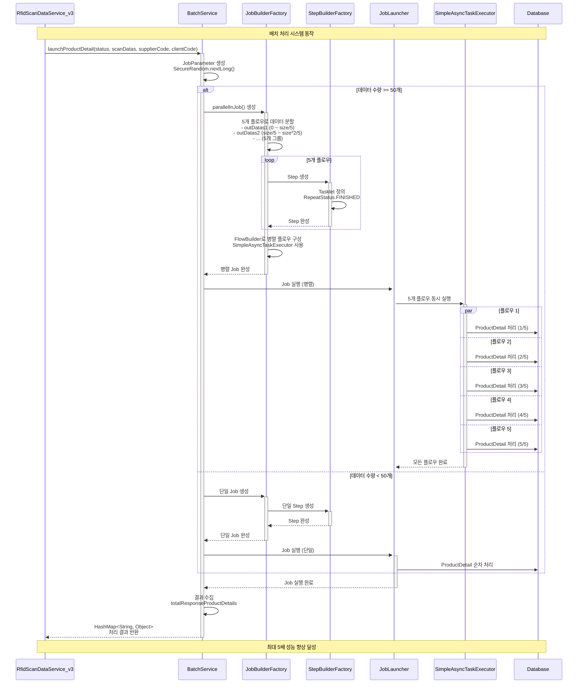
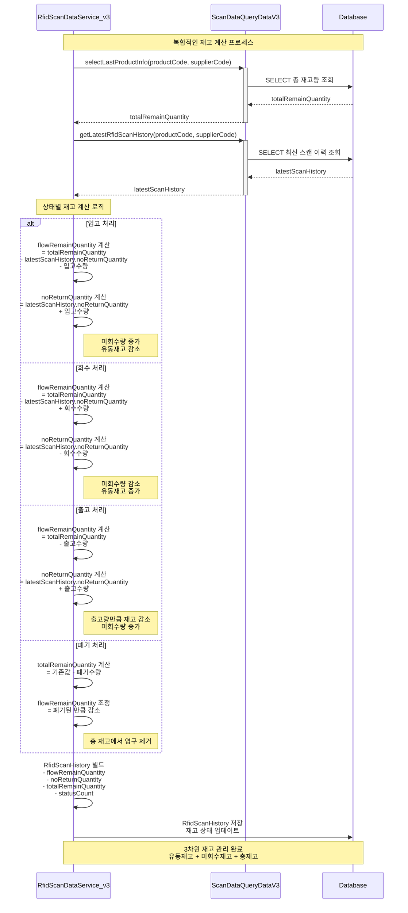

# 🎯 CircularLabs RFID 시스템 시퀀스 다이어그램

## 📋 개요

이 문서는 CircularLabs RFID 다회용기 관리 시스템의 핵심 기능들에 대한 시스템 시퀀스 다이어그램을 포함합니다. README.md에서 정의된 핵심 기능들을 실제 구현된 코드 구조를 바탕으로 상세하게 표현합니다.

## 🏗️ 시스템 아키텍처 개요

## 1. 📥 입고 처리 (Inbound) 시퀀스 다이어그램

## 2. 🔄 회수 처리 (Return) 시퀀스 다이어그램

## 3. 🗑️ 폐기 처리 (Discard) 시퀀스 다이어그램

## 4. 🔄 배치 처리 시스템 상세 시퀀스

## 5. 📊 재고 계산 로직 상세 다이어그램

## 📈 성능 최적화 포인트

### 1. 동시성 제어

- 모든 API 엔드포인트에 `synchronized` 키워드 적용
- 데이터 일관성 보장

### 2. 배치 처리 최적화

- 50개 이상 데이터: 5개 플로우 병렬 처리 (최대 5배 성능 향상)
- 50개 미만 데이터: 단일 플로우 순차 처리
- `SimpleAsyncTaskExecutor` 활용한 비동기 실행

### 3. 데이터베이스 최적화

- JPA Batch Insert로 벌크 처리
- EntityManager flush/clear로 메모리 관리
- QueryDSL 활용한 타입 안전 쿼리

### 4. 트랜잭션 관리

- `@Transactional` 어노테이션으로 일관성 보장
- 예외 발생 시 자동 롤백

## 🔍 주요 특징

1. **확장성**: 버전별 컨트롤러 관리 (v1, v2, v3)
2. **안정성**: 동기화된 API와 예외 처리
3. **성능**: 대용량 데이터 병렬 배치 처리
4. **추적성**: 완전한 제품 생명주기 추적
5. **일관성**: 복합적인 재고 계산 시스템

---

이 시퀀스 다이어그램들은 CircularLabs RFID 시스템의 실제 구현된 코드를 바탕으로 작성되었으며, 다회용기의 전체 생명주기 관리 프로세스를 상세하게 표현합니다.
