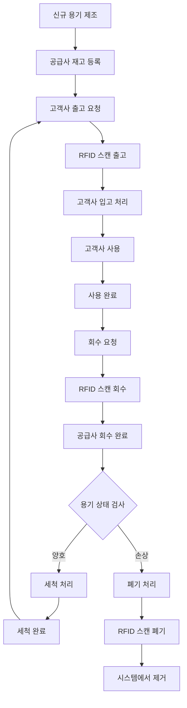

# 🔄 CircularLabs RFID 다회용기 관리 시스템 - 사용자 플로우

## 📋 개요

이 문서는 CircularLabs RFID 다회용기 관리 시스템의 실제 사용자 관점에서의 업무 플로우를 상세히 설명합니다. 공급사, 고객사, 현장 작업자의 관점에서 시스템이 어떻게 활용되는지 보여줍니다.

## 👥 주요 사용자 그룹

### 🏭 공급사 (Supplier)

- **역할**: 다회용기 제공 및 관리 주체
- **책임**: 용기 제조, 세척, 출고, 회수, 폐기 관리
- **사용 기능**: 전체 시스템 기능

### 🏢 고객사 (Client)

- **역할**: 다회용기 사용 주체
- **책임**: 용기 사용, 반납
- **사용 기능**: 입고/출고 확인, 사용량 모니터링

### 👷 현장 작업자 (Field Worker)

- **역할**: 실제 RFID 스캔 수행
- **책임**: 정확한 스캔 및 상태 처리
- **사용 기능**: RFID 스캔 앱, 상태 처리

---

## 🔄 전체 사용자 플로우 (다회용기 생명주기)



---

## 📦 1. 출고 프로세스 사용자 플로우

### 🏭 공급사 관점

#### 1.1 출고 준비 단계

```
📋 출고 주문 접수
├── 고객사로부터 주문 접수
├── 주문 수량 및 제품 확인
├── 재고 확인 (유동재고량 체크)
└── 출고 가능 여부 판단
```

#### 1.2 출고 실행 단계

```
📱 현장 작업자 RFID 스캔
├── 📱 RFID 스캔 앱 실행
├── 🏢 고객사 선택 (selectClientCode)
├── 🏭 공급사 코드 입력 (supplierCode)
├── 📟 RFID 스캐너로 용기 일괄 스캔
└── 📊 스캔 데이터 전송
```

#### 1.3 시스템 처리 단계

```
⚙️ 백엔드 자동 처리
├── 🔍 CCA2310 필터링 코드 검증
├── ❌ 폐기된 용기 자동 제외
├── 💾 ProductDetail 상태 업데이트
│   ├── 기존 용기: 상태 → "출고"
│   └── 신규 용기: 새로 등록
├── 📊 RfidScanHistory 생성
│   ├── 총재고량에서 출고량 차감
│   ├── 미회수량에 출고량 추가
│   └── 유동재고량 감소
└── 📋 ProductDetailHistory 이력 저장
```

#### 1.4 출고 완료 단계

```
✅ 출고 완료 확인
├── 📱 앱에서 출고 완료 알림
├── 📊 실시간 재고량 업데이트
├── 🚚 운송 준비
└── 📧 고객사에 출고 알림 전송
```

### 🏢 고객사 관점

#### 1.5 출고 물품 수령

```
📦 용기 수령 및 확인
├── 🚚 운송 차량 도착
├── 📋 출고 수량 대조
├── 🔍 용기 상태 육안 검사
└── ✅ 수령 완료 사인
```

---

## 📥 2. 입고 프로세스 사용자 플로우

### 🏢 고객사 관점

#### 2.1 사용 완료 후 준비

```
🔄 사용 완료 용기 준비
├── 🧹 용기 간단 세정 (음식물 제거)
├── 📦 용기 수집 및 정리
├── 📞 공급사에 회수 요청
└── ⏰ 회수 일정 조율
```

#### 2.2 회수 시점 처리

```
📱 고객사 직원 RFID 스캔
├── 📱 RFID 스캔 앱 실행
├── 🏢 고객사 코드 입력 (selectClientCode)
├── 🏭 공급사 코드 입력 (supplierCode)
├── 📟 반납할 용기 RFID 스캔
└── 📊 입고 데이터 전송
```

### 🏭 공급사 관점

#### 2.3 시스템 처리 단계

```
⚙️ 백엔드 자동 처리
├── ✅ 제품 유효성 검증 (공급사 제품 확인)
├── ⚡ 배치 처리 시스템 동작
│   ├── 50개 미만: 단일 플로우 처리
│   └── 50개 이상: 5개 플로우 병렬 처리
├── 📦 제품별 수량 그룹화 및 집계
├── 📊 RfidScanHistory 생성
│   ├── 미회수량 증가 (고객사에서 받은 수량)
│   ├── 유동재고량 감소 (세척 필요 상태)
│   └── 총재고량 유지
└── 📋 ProductDetailHistory 이력 저장
```

#### 2.4 입고 완료 처리

```
✅ 입고 완료 및 상태 관리
├── 📱 입고 완료 알림 수신
├── 🏷️ 용기 상태 라벨링 (세척 대기)
├── 🚛 세척 시설로 이동
└── 📊 재고 현황 실시간 업데이트
```

---

## 🔄 3. 회수 프로세스 사용자 플로우

### 🚚 운송/회수 담당자 관점

#### 3.1 회수 준비 단계

```
📋 회수 계획 수립
├── 📞 고객사별 회수 일정 확인
├── 🗺️ 최적 회수 경로 계획
├── 🚛 회수 차량 및 장비 준비
└── 📱 RFID 스캔 장비 점검
```

#### 3.2 현장 회수 실행

```
📱 현장에서 RFID 스캔
├── 🏢 고객사 도착
├── 📦 회수할 용기 확인
├── 📱 RFID 스캔 앱 실행
├── 🏭 공급사 코드 입력
├── 📟 용기별 RFID 일괄 스캔
└── 📊 회수 데이터 실시간 전송
```

### ⚙️ 시스템 자동 처리

#### 3.3 백엔드 처리 로직

```
🔄 복합 데이터 처리
├── ✅ 제품 유효성 검증
├── 🏢 고객사별 데이터 그룹화
│   ├── 고객사 A: 용기 20개
│   ├── 고객사 B: 용기 35개
│   └── 고객사 C: 용기 15개
├── 📦 제품별 수량 재그룹화
│   ├── 제품코드 P001: 총 40개
│   └── 제품코드 P002: 총 30개
├── 🔄 사이클 카운터 증가
│   ├── 각 용기의 재사용 횟수 +1
│   └── 사이클별 품질 관리 지표 업데이트
├── 📊 RfidScanHistory 생성
│   ├── 미회수량 감소 (회수된 수량만큼)
│   ├── 유동재고량 증가 (세척 후 재사용 가능)
│   └── 총재고량 유지
└── 📋 ProductDetailHistory 이력 저장
```

#### 3.4 회수 완료 후 처리

```
✅ 회수 완료 및 후속 처리
├── 📱 회수 완료 알림
├── 🏭 공급사 창고 도착
├── 🔍 용기 상태 검사
│   ├── ✅ 양호: 세척 라인으로 이동
│   └── ❌ 손상: 폐기 대상으로 분리
├── 📊 회수율 통계 업데이트
└── 📧 고객사에 회수 완료 알림
```

---

## 🗑️ 4. 폐기 프로세스 사용자 플로우

### 🔍 품질 관리자 관점

#### 4.1 폐기 대상 선별

```
🔍 용기 상태 검사
├── 🔄 일정 사이클 이상 사용된 용기 확인
├── 🔍 물리적 손상 검사
│   ├── 균열, 찌그러짐 확인
│   ├── RFID 칩 손상 여부 확인
│   └── 위생 상태 점검
├── 📋 폐기 기준 적용
│   ├── 사이클 횟수 기준 (예: 50회 이상)
│   ├── 안전 기준 미달
│   └── 수리 불가능한 손상
└── 🏷️ 폐기 대상 라벨링
```

#### 4.2 폐기 처리 실행

```
📱 폐기 RFID 스캔
├── 📱 RFID 스캔 앱 실행 (폐기 모드)
├── 🏭 공급사 코드 입력
├── 🏢 고객사 코드 입력 (마지막 사용처)
├── 📟 폐기 대상 용기 RFID 스캔
├── 📝 폐기 사유 입력
│   ├── "물리적 손상"
│   ├── "사이클 수명 완료"
│   ├── "안전 기준 미달"
│   └── "기타 (상세 입력)"
└── 📊 폐기 데이터 전송
```

### ⚙️ 시스템 처리

#### 4.3 폐기 데이터 처리

```
🗑️ 폐기 처리 로직
├── 🔍 CCA2310 필터링 코드 재검증
├── 💾 ProductDetail 상태 업데이트
│   ├── 상태: "폐기"로 변경
│   ├── 최종 사용 위치 기록
│   └── 폐기 일시 기록
├── 📋 ProductDetailHistory 생성
│   ├── 폐기 이력 상세 기록
│   ├── 최종 사이클 수 기록
│   └── 폐기 처리자 정보
├── 🗑️ DiscardHistory 별도 생성
│   ├── 폐기 사유 상세 기록
│   ├── 폐기 승인자 정보
│   ├── 폐기 방법 기록
│   └── 환경 처리 방법
└── 📊 총재고량에서 영구 차감
```

#### 4.4 폐기 완료 처리

```
♻️ 폐기 완료 및 환경 처리
├── ✅ 시스템에서 영구 제거
├── ♻️ 환경친화적 폐기 처리
│   ├── 재활용 가능 소재 분리
│   ├── RFID 칩 회수 및 재활용
│   └── 플라스틱 소재 재활용 처리
├── 📊 폐기 통계 업데이트
│   ├── 월별 폐기율 계산
│   ├── 평균 사이클 수 분석
│   └── 폐기 사유별 통계
└── 📋 폐기 완료 보고서 생성
```

---

## 📊 5. 관리자 대시보드 사용자 플로우

### 📈 운영 관리자 관점

#### 5.1 일일 운영 모니터링

```
📊 실시간 대시보드 확인
├── 📈 재고 현황 모니터링
│   ├── 유동재고 (즉시 출고 가능)
│   ├── 미회수재고 (고객사 보유)
│   ├── 세척대기 (입고 완료)
│   └── 총재고량 트렌드
├── 🔄 일일 처리 현황
│   ├── 출고 건수 및 수량
│   ├── 입고 건수 및 수량
│   ├── 회수 건수 및 수량
│   └── 폐기 건수 및 수량
├── 🚨 알람 및 예외 사항
│   ├── 재고 부족 경고
│   ├── 미회수 기간 초과
│   ├── 시스템 오류 알림
│   └── 용기 분실 의심 건
└── 📋 고객사별 사용 현황
```

#### 5.2 주간/월간 분석

```
📊 심화 분석 리포트
├── 📈 비즈니스 KPI 분석
│   ├── 용기 회전율 (Turnover Rate)
│   ├── 고객사별 사용량 트렌드
│   ├── 평균 사이클 수명
│   └── 폐기율 분석
├── 💰 비용 효율성 분석
│   ├── 용기당 운영 비용
│   ├── 운송 효율성 분석
│   ├── 세척 비용 분석
│   └── ROI 계산
├── 🎯 성능 최적화 지표
│   ├── 배치 처리 성능
│   ├── API 응답 시간
│   ├── 시스템 가용성
│   └── 오류율 분석
└── 📋 개선 사항 도출
```

---

## 🚨 6. 예외 상황 처리 플로우

### 6.1 RFID 칩 손상/인식 불가

```
❌ RFID 스캔 실패
├── 📱 앱에서 스캔 실패 알림
├── 🔍 육안으로 용기 확인
├── 📝 수동 입력 모드 전환
│   ├── 용기 시리얼 번호 직접 입력
│   ├── 제품 코드 선택
│   └── 상태 처리 진행
├── 🏷️ RFID 교체 필요 라벨링
└── 📋 RFID 교체 작업 지시서 생성
```

### 6.2 용기 분실 처리

```
🔍 용기 분실 감지
├── 📊 미회수 기간 초과 알림
├── 📞 고객사 연락 및 확인
├── 🔍 분실 사유 조사
│   ├── 고객 측 보관 확인
│   ├── 운송 과정 추적
│   └── 시스템 오류 점검
├── 📋 분실 처리 결정
│   ├── 분실 확정 시 → 폐기 처리
│   ├── 일시 보관 시 → 회수 연장
│   └── 시스템 오류 시 → 데이터 복구
└── 💰 분실 비용 정산
```

### 6.3 시스템 장애 처리

```
🔧 시스템 장애 대응
├── 🚨 장애 감지 및 알림
├── 📱 오프라인 모드 전환
│   ├── 로컬 데이터 저장
│   ├── 배치 처리 대기
│   └── 복구 후 동기화
├── 🔧 장애 원인 분석
│   ├── 서버 상태 점검
│   ├── 네트워크 연결 확인
│   └── 데이터베이스 상태 확인
├── ⚡ 신속 복구 작업
└── 📊 복구 후 데이터 무결성 검증
```

---

## 🎯 7. 비즈니스 가치 실현 플로우

### 7.1 환경 효과 측정

```
🌱 환경 영향 지표 추적
├── 📊 일회용품 절약량 계산
│   ├── 절약된 일회용 용기 개수
│   ├── 플라스틱 절약량 (톤)
│   └── CO2 절감량 계산
├── ♻️ 재활용 효과 분석
│   ├── 용기 재사용 횟수 통계
│   ├── 소재 재활용률
│   └── 폐기물 감소량
└── 📋 지속가능성 리포트 생성
```

### 7.2 경제적 효과 분석

```
💰 비용 절감 효과 측정
├── 📊 운영 비용 분석
│   ├── 용기 제조 비용 절감
│   ├── 폐기물 처리 비용 절감
│   └── 운송 효율성 개선
├── 💼 고객사 만족도 조사
│   ├── 사용 편의성 평가
│   ├── 비용 절감 효과
│   └── 브랜드 이미지 개선
└── 📈 ROI 및 성장 전략 수립
```

---

## 🔧 8. 기술적 최적화 플로우

### 8.1 성능 모니터링

```
⚡ 시스템 성능 최적화
├── 📊 API 응답 시간 모니터링
├── 🔄 배치 처리 성능 추적
│   ├── 50개 미만: 단일 처리 성능
│   ├── 50개 이상: 병렬 처리 효과
│   └── 메모리 사용량 최적화
├── 💾 데이터베이스 성능 튜닝
│   ├── 쿼리 실행 계획 분석
│   ├── 인덱스 최적화
│   └── 캐시 활용률 개선
└── 📱 모바일 앱 성능 개선
```

### 8.2 확장성 계획

```
📈 시스템 확장 로드맵
├── 🏢 신규 고객사 온보딩
│   ├── 고객사별 커스터마이징
│   ├── 통합 테스트 진행
│   └── 점진적 서비스 확대
├── 🌍 지역별 확장 계획
│   ├── 권역별 서버 구축
│   ├── 네트워크 지연 최적화
│   └── 다국어 지원 추가
└── 🔮 미래 기술 도입 계획
    ├── AI 기반 수요 예측
    ├── IoT 센서 통합
    └── 블록체인 이력 관리
```

---

이 사용자 플로우 문서는 CircularLabs RFID 시스템의 실제 운영 상황에서 다양한 사용자들이 시스템과 상호작용하는 방식을 상세히 보여줍니다. 각 프로세스는 실제 현장의 요구사항과 비즈니스 가치를 반영하여 설계되었습니다.
